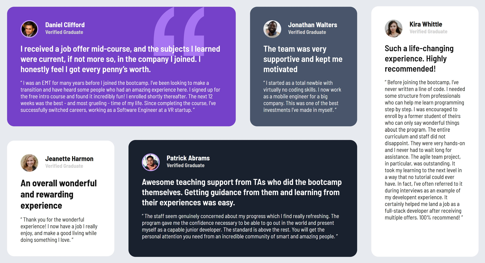

# Frontend Mentor - Testimonials grid section solution

This is a solution to the [Testimonials grid section challenge on Frontend Mentor](https://www.frontendmentor.io/challenges/testimonials-grid-section-Nnw6J7Un7). Frontend Mentor challenges help you improve your coding skills by building realistic projects. 

## Table of contents

- [Overview](#overview)
  - [The challenge](#the-challenge)
  - [Screenshot](#screenshot)
  - [Links](#links)
- [My process](#my-process)
  - [Built with](#built-with)
  - [What I learned](#what-i-learned)
  - [AI Collaboration](#ai-collaboration)
- [Author](#author)

## Overview

### The challenge

Users should be able to:

- View the optimal layout for the site depending on their device's screen size

### Screenshot

### Links

- Solution URL: [Click here]()
- Live Site URL: [Click here](https://khaledsilva.github.io/testimonials-grid/)

## My process

### Built with

- Semantic HTML5 markup
- CSS custom properties
- Flexbox
- CSS Grid
- Mobile-first workflow

### What I learned

Ways to structure a page using Grid for better organization and alignment—achieving layouts that aren’t possible with Flexbox alone—while understanding when it’s best to use each one and how to combine both effectively.

### AI Collaboration

It was done using ChatGPT to assist with layout alignment and Copilot to optimize the creation of the basic HTML structure.

## Author

- Github - [@KhaledSilva](https://github.com/KhaledSilva)
- Linkedin - [@khaled-silva](https://www.linkedin.com/in/khaled-silva/)

